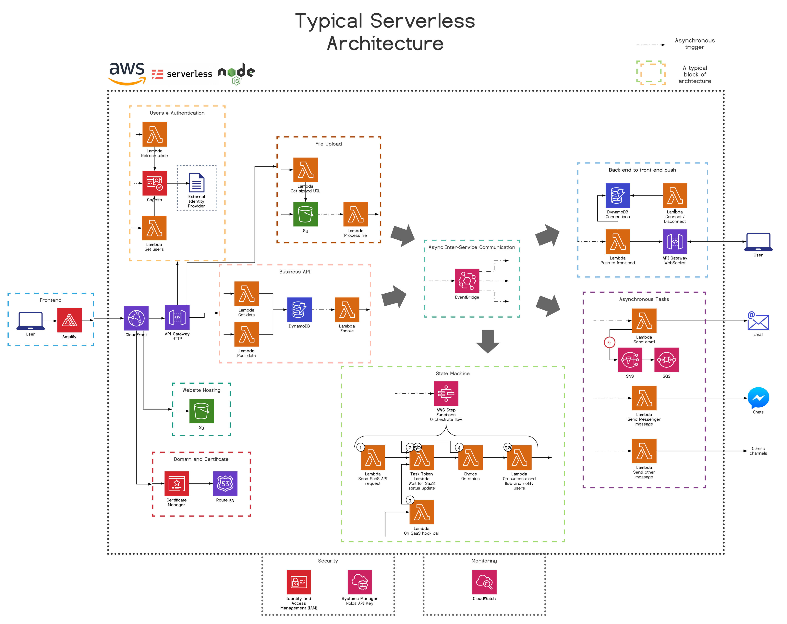
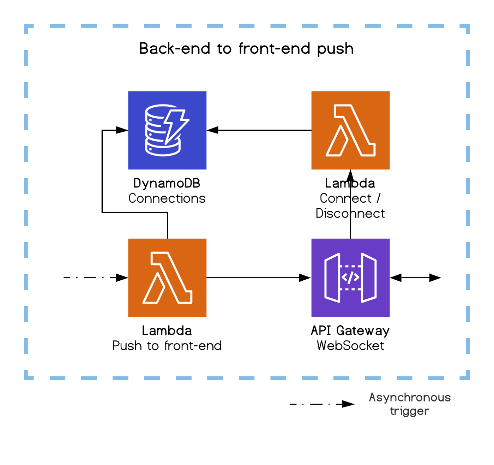

# Serverless Breakdown

A core concept is that:
- Each lambda should do one very specific task
- Break complex projects into microservices!! (One micro-service = one CloudFormation Stack = one set of terraform files)
- Reactivity should be event-driven.

## Architecture Blueprint

## Async Inter-Service Communication

Our micro-services need to be fully independent. If breaking changes are made to one service, others should be unaffected.

To aid in this, Lambdas should only communicate to one other through EventBridge.

## Frontend

Amplify

## Hosting

CloudFront
S3

## Domain & Certificate

CloudFront -> Certificate Manager -> Route53

## Example API

API --> Two Lambdas --> DynamoDB --> Lambda

We leverage API Gateway to handle HTTP connections and routes.

A lambda is *synchronously* triggered for each route.

Lambdas contain logic which is communicated with DynamoDB in order to store and consume data.

## Asynchronous Tasks

Lambda 1 --> Email
(on error) --> SNS --> SQS

Lambda 2 --> Chats

We can trigger lambda 1 and 2 at the same time.

Additionally, failure handling is supported via Dead Letter Queues (DLQ). We can pass the final failure message first to SNS, and then to SQS.

## Backend to Frontend Pushing

With async operations, the frontend can't just display a loader while waiting for an xhr response. Now we need pending states and data push from the backend. To do so we take advanctage of the WebSocket API of API Gateway, which keeps the WebSocket connection alive for us and only triggers our Lambdas on request.

[A good article on the subject](https://medium.com/serverless-transformation/asynchronous-client-interaction-in-aws-serverless-polling-websocket-server-sent-events-or-acf10167cc67).

## File Upload

Instead of handling the file upload stream from Lambda, which can get costly, S3 offers the possibilty for Lambdas to generate a signed (secured) upload URL that will be used by our front-end to directly upload the file to S3. 

Lambda (Gets signed URL) --> S3

S3 --> Lambda (process file)

So, we call upon S3 and Lambda asynchronously. Lambda gets the signed url for S3, and then S3 calls a Lambda when it's ready for the file to be processed.

## Users and Authentication

API Gateway --> Lambda --> DynamoDB

Cognito is great, but limited.

## State Machine

Step Functions --> Tree of lambdas

We may want to wait for certain lambdas to finish before starting another elsewhere. Step Functions are great for this.

## Security

IAM & Systems Managers (Holds API Keys)

IAM
- Manages CI/CD Pipeline Permissions
- Developer permissions
- AWS Service interactivity 

Systems Manager
- We can request sensitive data, like API Keys, from Systems Manager within our Terraform files (or even from within our code associated with the associated SDK).

Secrets Manager and KMS are also viable alternatives to Systems Manager.

## Monitoring

CloudWatch

